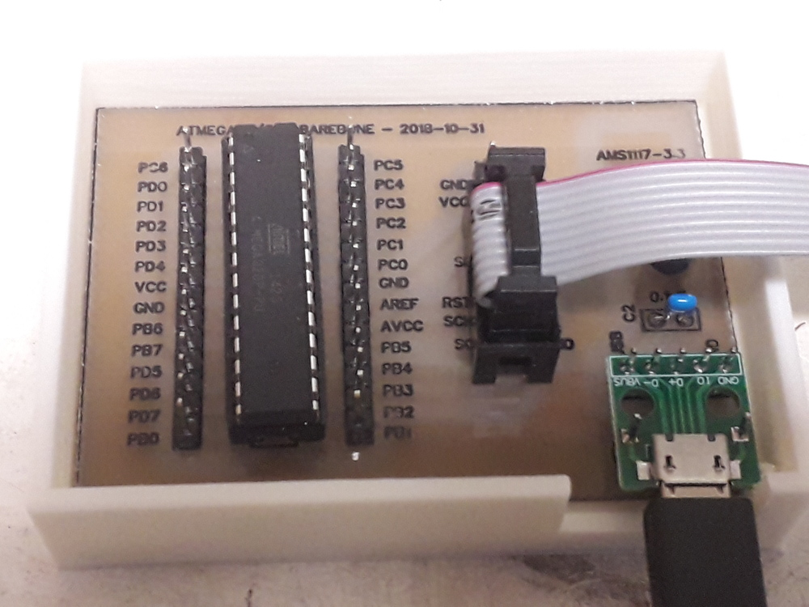

# iot-atmega-bare

atmega barebone

## features

- simple [atmega8](https://www.microchip.com/wwwproducts/en/ATmega8)/[328](https://www.microchip.com/wwwproducts/en/ATmega328) holder
- ICSP connector
- micro usb connector with [ams1117-3.3](http://www.advanced-monolithic.com/pdf/ds1117.pdf) voltage regulator
- missing reset button ( can easily replaced for testing purpose by a F-F dupont cable attached to U4 GND that touch reset PC6 when needed )

## prerequisites

- [atmega barebone schematics/pcb](https://easyeda.com/lorenzo.delana/atmega-barebone) can be etched using this [procedure](https://github.com/devel0/knowledge/blob/master/electronics/pcb-etching.md) on a copper 70x49mm ; notes:
  - use flux to ease soldering
  - 0.8mm drill bit for 14x2 atmega socket and C1 electrolitic ; 1.0mm for other holes  
- plastic case can be built using 3d printer and this [parametric](https://www.thingiverse.com/apps/customizer/run?thing_id=3182923)
  - part : `box`
  - wt : `2`
  - lss : `[2, 2, 2]`
  - is : `71.5, 50.5, 10`
  - oc : `1`
  - lh = rh = bh : `[]`
  - fh = `[ [ 18, 12, 60.5, false, wt + lss[2] ] ]`
- usbasp programmer
- serial debug : use an usb/ttl converter connecting `GND`, `RX` to atmega `GND`, `RX` ( PD1 )
- [arduino-utils](https://github.com/devel0/iot-arduino-utils) allow to save precious flash
- [vscode](https://github.com/devel0/knowledge/blob/master/electronics/vscode-arduino.md)
