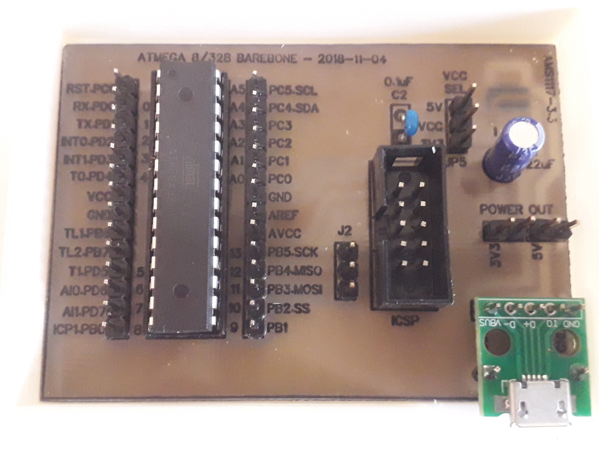

# iot-atmega-bare

atmega barebone

## features

- simple [atmega8](https://www.microchip.com/wwwproducts/en/ATmega8)/[328](https://www.microchip.com/wwwproducts/en/ATmega328) holder
- ICSP connector
- micro usb connector with [ams1117-3.3](http://www.advanced-monolithic.com/pdf/ds1117.pdf) voltage regulator
- missing reset button ( can easily replaced for testing purpose by a F-F dupont cable attached to U4 GND that touch reset PC6 when needed )
- JP5 ( VCC voltage selector between 3V3 or 5VUSB )
- power out GND-3V3 GND-5V addictionals
- J2 SPI addictional (MOSI, MISO, SCK)
- atmega can programmed by usbasp through ICSP connector while for example an enc28j60 or W5500 connected to PB2,PB3,PB4,PB5 and another device like an SD card can be attached through J2 addictional SPI.

## prerequisites

- [arduino-utils](https://github.com/devel0/iot-arduino-utils) allow to save precious flash
- [vscode](https://github.com/devel0/knowledge/blob/master/electronics/vscode-arduino.md)

## build it

- atmega barebone [schematics](https://easyeda.com/editor#id=36a8af576a884b809b451cad653df65e) and [pcb](https://easyeda.com/editor#id=20225a3eb23b4056ba70d404b958c17d) can be etched using this [procedure](https://github.com/devel0/knowledge/blob/master/electronics/pcb-etching.md) on a copper 70x49mm
  - [pcb](doc/pcb.pdf) and [labels](doc/labels.pdf) ready to print
  - use flux to ease soldering
  - 0.8mm drill bit for C1 electrolitic ; 1.0mm for other holes  
- plastic case can be built using 3d printer and this [parametric](https://www.thingiverse.com/thing:3182923)
  - part : `box`
  - wt : `2`
  - lss : `[2, 2, 2]`
  - is : `71.5, 50.5, 10`
  - oc : `1`
  - lh = rh = bh : `[]`
  - fh = `[ [ 18, 12, 60.5, false, wt + lss[2] ] ]`

## programming

- connect an usbasp programmer to ICSP connector
- barebone icsp connector doesn't have VCC connected to avoid voltage source mixture

## debugging

- use an usb/ttl converter connecting `GND`, `RX` to atmega `GND`, `RX` ( PD1 )

## SPI

Each SPI device must honor MISO (MasterInputSlaveOutput) detaching when its CS (ChipSelect) goes high or this can create communication problems; to be able to do that device must use a TriState buffer (eg. [SN74LVC125A](http://www.ti.com/lit/ds/symlink/sn74lvc125a.pdf)). A good explain [here](https://www.dorkbotpdx.org/blog/paul/better_spi_bus_design_in_3_steps).
Recently I bought an SD card breakout board that mount LVC125A chipset and at the end I found out a thread that explain why it was not working as expected: there was pin13 4OE (driving MOSI) connected to GND permanently where it need to be connected to pin8 3Y (CS signal) to enable/disable MOSI correctly. I ended up fixing it as described by [this saver](http://forum.arduino.cc/index.php?topic=360718.msg2942160#msg2942160). Hopefully exists a [new version](https://forum.arduino.cc/index.php?topic=360325.msg2942982#msg2942982) but not the one I had recently.
